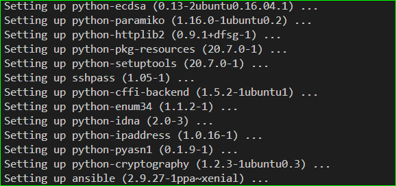

- on controller machine, install ansible using the following commands

`sudo apt update
 sudo apt install software-properties-common
 sudo add-apt-repository --yes --update ppa:ansible/ansible
 sudo apt install ansible`

 

 - login into the first server, create a user

 fingerprint of the host is stored in cat ~/.ssh/known_hosts

 - to tell ansible to ignore the checking
 edit vi /etc/ansible/ansible.cfg