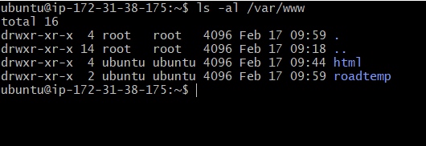

## Host your custom site on apache server

1. create an EC2 instance and launch the instance, then run the following commands

`sudo apt update`

2. Install apache2 sever on your ubuntu using this command

`sudo apt install apache2`

3. check if the apache is up and running by using this command

`sudo systemctl status apache2`

4. create a domain called project by using the command below

`sudo mkdir /var/www/roadtemp`
- then , assign ownwership of the directory with the current system user(ubuntu) by using

`sudo chown -r $USER:$USER /var/www/project`

- Then create a new configuration file in Apache's sites-available directory using

`sudo vi /etc/apache2/sites-available/project.conf`

- then enable the site by running
`sudo a2ensite project`

- Disable the apache default site by running
`sudo a2dissite 000-default`

4. I will clone one of the website on my github repository that I made in /etc/apache2/sites-available

`sudo git clone https://github.com/Linsmed/temp-backroads-app.git `

5. Then copy the content of your repository into your new domain by running

`sudo cp -R alt_sch_assignment3 /var/www/project`

6. reload your apache site on your browser..Your website should be ready

## Note that you can host multiple websites on your apache server, all you need to do is to create multiple host.

### Hosting of second website on my apache server

1. create another domain named lismed

`sudo mkdir /var/www/linsmed`

2. Assign the ownership of the directory to the current user

`sudo chown -R $USER:$USER /var/www/linsmed `

3. create a new configuration file in apache's sites-available

`sudo vi /etc/apache2/sites-available/linsmed.conf`

4. Copy the content of 000-default.conf into project.conf and edit the document root

`sudo cp 000-default.conf limsmed.conf`

5. Enable the site by running
`sudo a2ensite linsmed`

6. Reload apache by running

`sudo systemctl reload apache2`

7. cd into /var/www