### MORE LINUX COMMANDS AND THEIR USAGE

1. `whoami` and `pwd`

- IT tells you who log in into the server

- pwd tells the present working directory

2. `cat /etc/os-release`

- this commnd reads a file , and this file will tell us what type of opersting system it is and the version
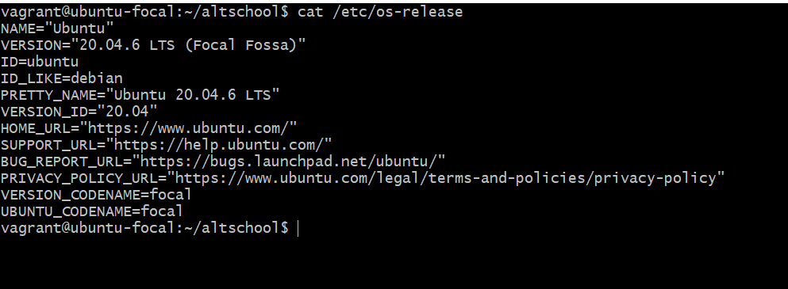

3. mv is used to move a file to another file, folder to another folder

- if you want to do multiple things with mv, use

`mv *.txt textdir`

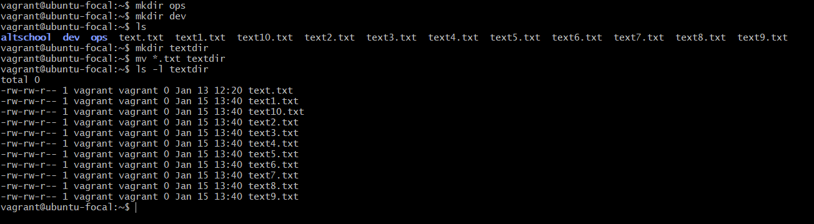

4. grep command is used to quickly searc through files 

`grep -i five dev12.txt`
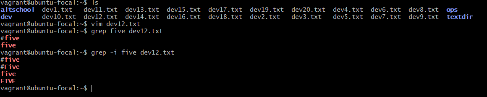

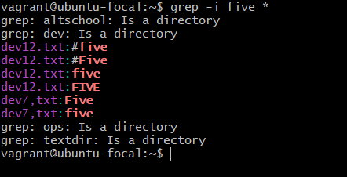

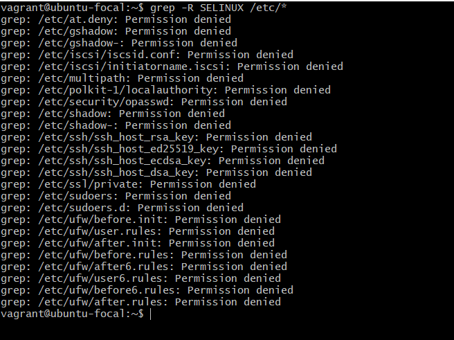

- grep has another option which is R, ehich is to search for directories too and option v which means ot search for argument provided
`grep -v five dev12.txt`
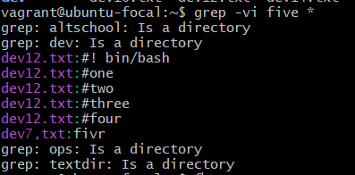

5.  less is another command that is called reader, you can also search while using this command

`less dev12.txt`
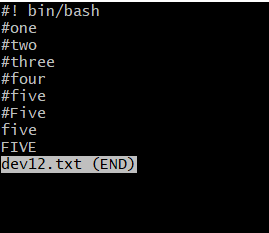

6.  more is another reader
`more dev12.txt`

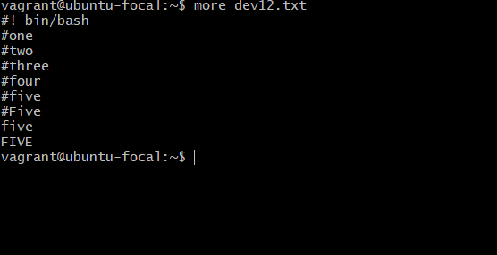

7. Tail is used to show the last to content of a file
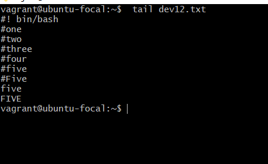

8. Head is used to show the first 10 content of a file

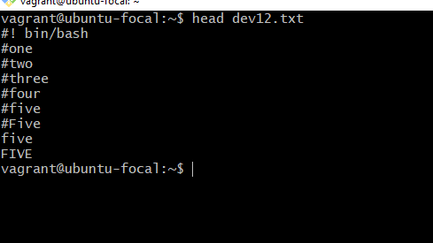

9. cut command is used to cut out the needed information

10. sed command is used to search and replace word
`sed -i 's/covid19/coronavirus/g' *`

11. Groupadd is used to add username to a group
12. groupmod is used to change the name of a group to a new name
13. groupdel is used to delete a group

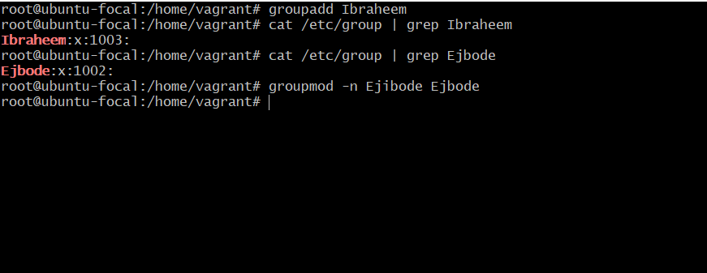