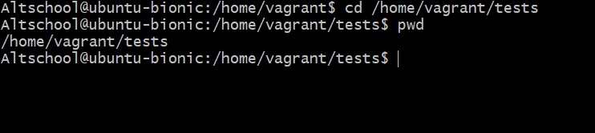
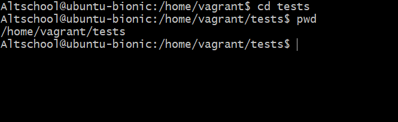
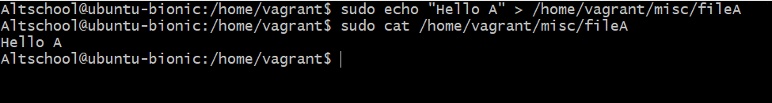
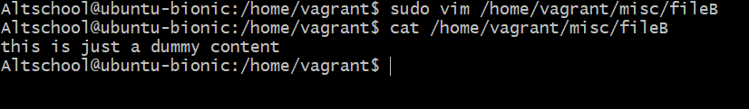
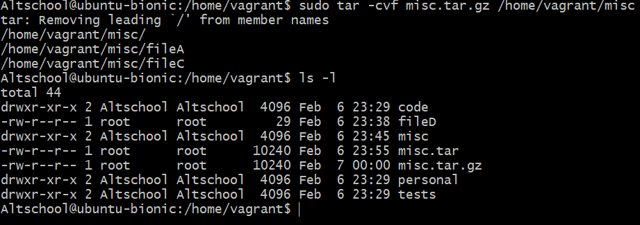
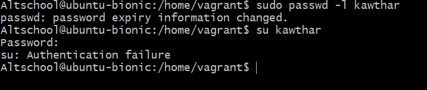
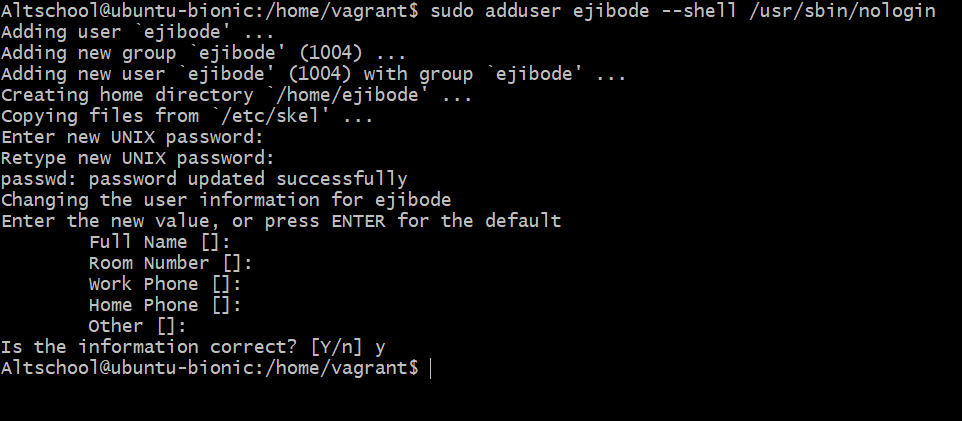

## This is the solution of the live classes first assignment
## Questions:

#### Your login name: altschool i.e., home directory /home/altschool. The home directory contains the following sub-directories: code, tests, personal, misc Unless otherwise specified, you are running commands from the home directory.

`pwd` to see the present working directory

`mkdir code tests personal misc` to create the subdirectories

1. Change directory to the tests directory using absolute pathname

`cd /home/vagrant tests`

2. Change directory to the tests directory using relative pathname

`cd tests`

3. Use echo command to create a file named fileA with text content ‘Hello A’ in the misc directory

` echo "Hello A" > /home/vagrant/misc/fileA`

4. Create an empty file named fileB in the misc directory. Populate the file with a dummy content afterwards

`vim /home/vagrant/misc/fileB`

5. Copy contents of fileA into fileC

`cp /home/vagrant/misc/fileA /home/vagrant/misc/fileC`

6. Move contents of fileB into fileD

`mv /home/vagrant/misc/fileB /home/vagrant/fileD`

7. Create a tar archive called misc.tar for the contents of misc directory

`tar -cvf misc.tar /home/vagrant/misc`

8. Compress the tar archive to create a misc.tar.gz file

`tar -cvf misc.tar.gz /home/vagrant/misc`

9. Create a user and force the user to change his/her password upon login

`sudo useradd kawthar`
`sudo passwd kawthar`
`sudo passwd --expire kawthar`

10. Lock a users password

`passwd -l kawthar`

11. Create a user with no login shell

`sudo adduser testuser1 --shell /usr/sbin/nologin`

12. Disable password based autehntication for ssh

`vim /etc/ssh/sshd_config`

- Look for the line PasswordAuthentication yes and replace yes with no.

- Now restart the server by running the following command.

`service sshd restart`

13. Disable root login for ssh

`vi /etc/ssh/sshd_config`

- locate the directive PermitRootLogin,
- Uncomment the line and change the directive No.
- Save and close the file. Restart the SSH daemon to save the changes by executing one of the commands below,

`/etc/init.d/sshd restart
systemctl restart sshd
service sshd restart`

