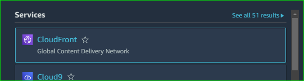

- create a s3 bucket

- choose a name tag for your bucket and click on the create bucket

- then upload the files and the folder

- save the changes

-under service, search cloudfront and select it

- I am stuck here presently and this is the error I am getting

- so, to resolve the issue, I made a case and requested  for increase in quota, but no response yet from AWS
