## Altschool second semester exam

- I automated the provisioning of two Ubuntu-based servers, named “Master” and “Slave”, using Vagrant.

- Then I ran the command below to bring up the two vms
  `vagrant up`

- Then I ran the command below to enter my master machine

`vagrant ssh master`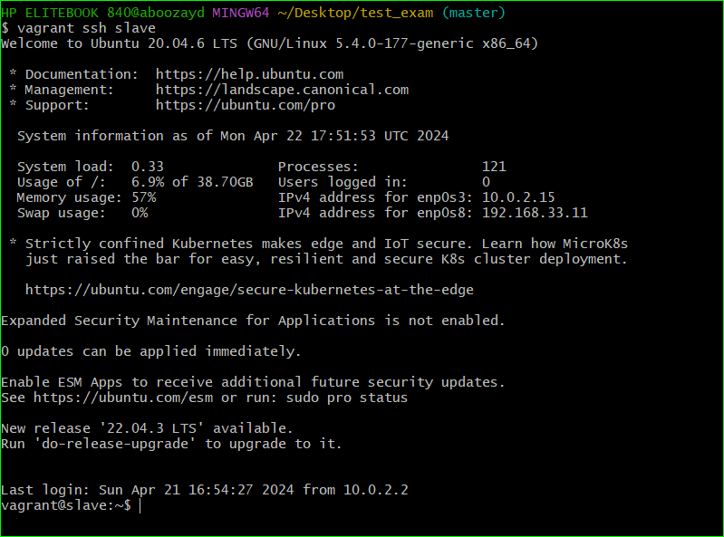

- try and ssh into the slave node from master node

`ssh vagrant@192.168.11`

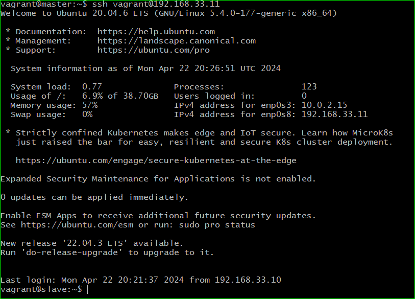

- Try and enter into the slave machine by running

`vagrant ssh slave`

- install ansible on your master node using

`sudo apt install ansible`

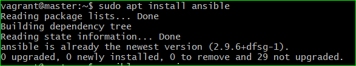

- check the version of ansible installed

 ` ansible --version `

 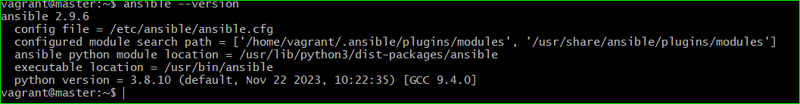

 - on your master node, edit the ssh configuration file and do the same on the slave node.

 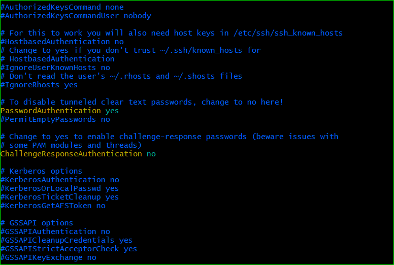

- Then update the inventory file on master node

 

 - update the local ansible configuration file on master

 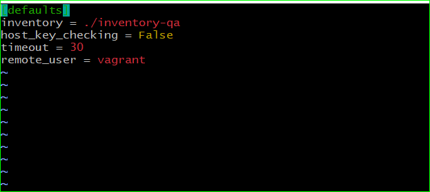

 - update your hosts config file

 `sudo vim /etc/hosts`

 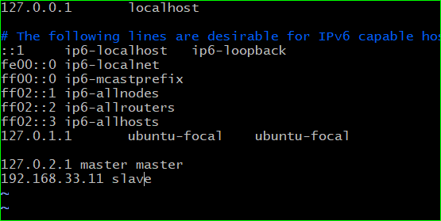

 - try and ping the slave node

 `ansible -i inventory-qa -m ping slave`

 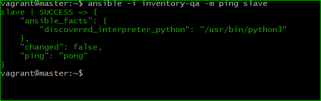

 - write your bash script and playbook and run your playbook

 `ansible-playbook inventory-qa webdeploy.yml`

 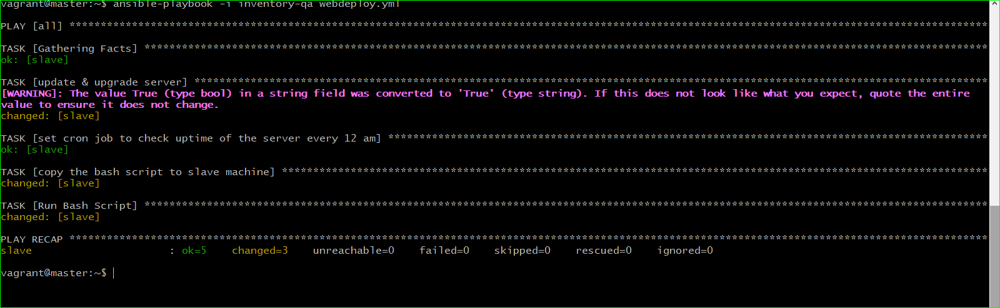

 - After a while, copy the ip address of the slave and paste it on a browser

 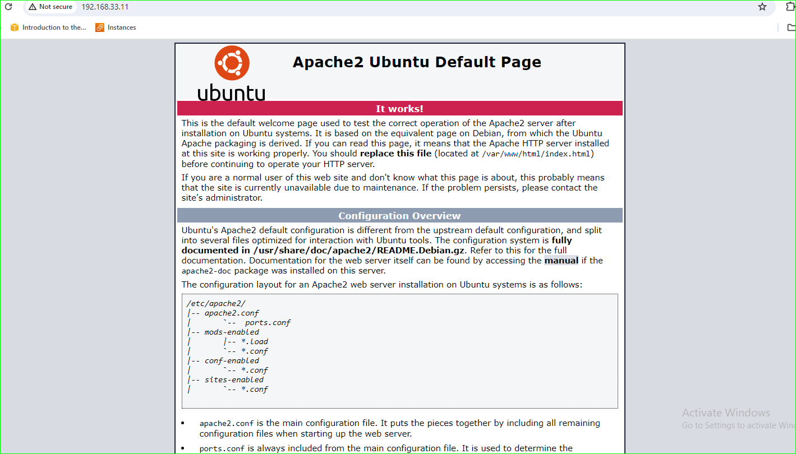

 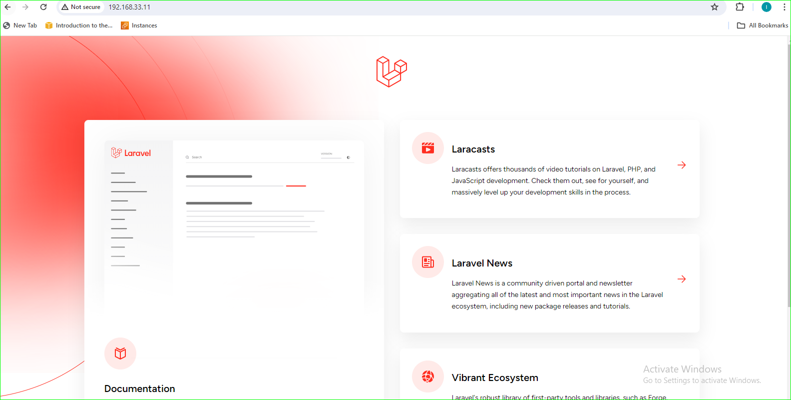