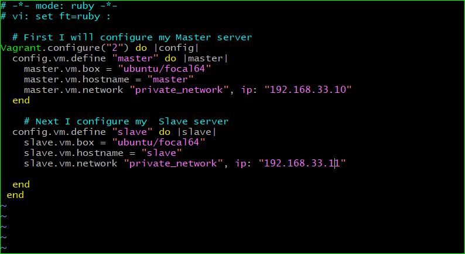

## Altschool second semester exam

- I automated the provisioning of two Ubuntu-based servers, named “Master” and “Slave”, using Vagrant.

- Then I ran the command below to bring up the two vms
`vagrant up`

- Then I ran the command below to enter my master machine

`vagrant ssh master`
